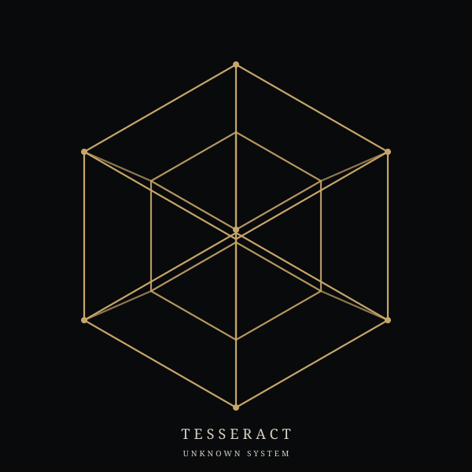
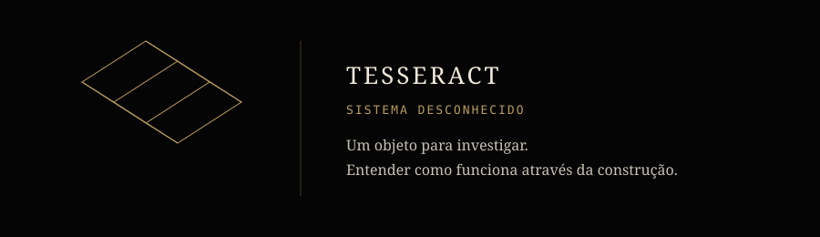

<div align="center">

</div>

   TECHNOLOGY EXPLORATION 

 Construindo para entender como sistemas funcionam.
 


</div>

---
<div align="center">



</div>

-------------------------------------------------------

## FRONTEIRAS ATUAIS
 
Áreas que estou explorando no momento:

`AI` · `AGENTES` · `ROBÓTICA` · `AUTOMAÇÃO` · `APLICATIVOS` · `BIOTECNOLOGIA` 

## LABORATÓRIO 

> Experimentos, prototipos e ideias que estou investigando.
>
> Projetos pequenos também fazem parte do processo.
>
> Aqui, o objetivo é descobrir como as coisas funcionam através da construção.


 ## ENGENHARIA
> Projetos em que uma ideia começa a se transformar em um sistema.
>
> Arquitetura, implementação, testes, integração e tudo que for necessário pra fazer uma ideia funcionar de verdade.

## PRODUTOS
>Projetos que ultrapassaram a fase de experimento e podem se transformar em algo útil para pessoas.
>
>A ideia é explorar não apenas o que pode ser construído, mas também o que pode ser feito com aquilo. 

## MÉTODO

```text
┌──────────────────┐
│   CURIOSIDADE    │
└────────┬─────────┘
         ↓
┌──────────────────┐
│   INVESTIGAÇÃO   │
└────────┬─────────┘
         ↓
┌──────────────────┐
│    CONSTRUÇÃO    │
└────────┬─────────┘
         ↓
┌──────────────────┐
│      TESTES      │
└────────┬─────────┘
         ↓
┌──────────────────┐
│   ENTENDIMENTO   │
└────────┬─────────┘
         ↓
┌──────────────────┐
│ NOVA CURIOSIDADE │
└──────────────────┘
```

>Estou aqui para descobrir até onde essas perguntas podem me levar.

 ## AGORA
>Atualmente explorando novas ideias, construído experimentos e tentando entender sistemas cada vez mais complexos. 
